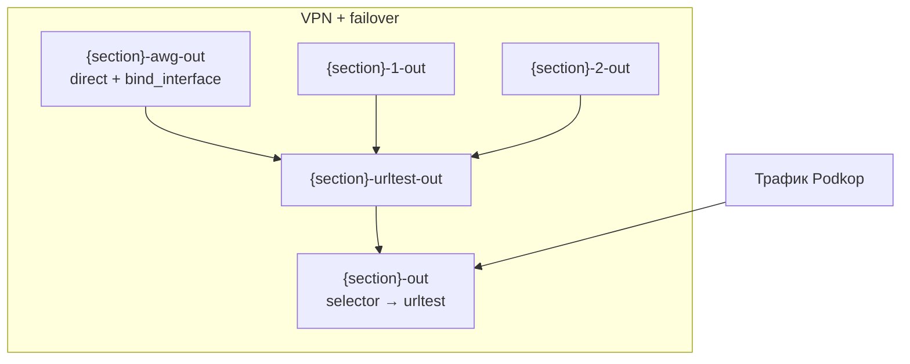

# Podkop Hybrid Failover: полное описание

Доработка [Podkop](https://github.com/itdoginfo/podkop) для OpenWrt: нативный **VPN + резервные proxy** через **urltest** в sing-box, поддержка **Amnezia `vpn://`**, расширенный **URLTest**, **Telegram-бот** и **LuCI** на русском.

Базовая версия upstream: **podkop v0.7.10** (`/usr/bin/podkop`).

---

## Содержание

1. [Архитектура](#архитектура)
2. [Режимы маршрутизации](#режимы-маршрутизации)
3. [Поддерживаемые форматы ссылок (URI)](#поддерживаемые-форматы-ссылок-uri)
4. [Опции UCI](#опции-uci)
5. [Пакеты OpenWrt](#пакеты-openwrt)
6. [Установка](#установка)
7. [LuCI](#luci)
8. [Telegram-бот](#telegram-бот)
9. [Диагностика (Clash API)](#диагностика-clash-api)
10. [Типичные проблемы](#типичные-проблемы)
11. [Содержимое репозитория](#содержимое-репозитория)

---

## Архитектура

Без пост-хуков после `sing_box_save_config`: логика failover встроена в `/usr/bin/podkop` и собирает outbounds при генерации конфига sing-box.



Для секции `glob` (имя произвольное, теги с этим префиксом):

| Outbound | Назначение |
|----------|------------|
| `{section}-awg-out` | Основной путь: **direct** через VPN-интерфейс (`option interface`, напр. `awg0`) |
| `{section}-1-out`, `{section}-2-out`, … | Резервы из `failover_proxy_links` (по одному на URI) |
| `{section}-urltest-out` | **urltest** по AWG + всем резервам |
| `{section}-out` | **selector**, по умолчанию указывает на urltest (как в stock proxy urltest) |

Порядок URI в списке = приоритет кандидатов после основного VPN (внутри urltest выбирается живой/быстрый).

---

## Режимы маршрутизации

### 1. VPN + failover (новое)

| UCI | Значение |
|-----|----------|
| `connection_type` | `vpn` |
| `failover_vpn_enabled` | `1` |
| `failover_proxy_links` | список URI (см. таблицу ниже) |
| `interface` | VPN-интерфейс, напр. `awg0` |

Поведение: трафик секции сначала идёт через VPN-интерфейс; при недоступности: urltest переключается на резервные proxy из списка.

### 2. Proxy → URLTest (stock Podkop, доработан)

| UCI | Значение |
|-----|----------|
| `connection_type` | `proxy` |
| `proxy_config_type` | `urltest` |
| `urltest_proxy_links` | список URI |

Только proxy, без `bind_interface`. Те же URI и те же доп. опции urltest (см. ниже).

### Общие параметры URLTest

Работают и для **VPN + failover**, и для **proxy urltest**:

| Опция UCI | По умолчанию | Описание |
|-----------|--------------|----------|
| `urltest_check_interval` | `3m` | Интервал проверки |
| `urltest_tolerance` | `50` | Допуск по задержке (ms) |
| `urltest_testing_url` | `https://www.gstatic.com/generate_204` | URL для probe |
| `urltest_idle_timeout` | пусто | Таймаут простоя urltest (напр. `5m`) |
| `urltest_interrupt_exist_connections` | `0` | `1`: рвать существующие сессии при смене узла |
| `enable_udp_over_tcp` | н/п | Для SS/SOCKS в списках ссылок |

---

## Поддерживаемые форматы ссылок (URI)

Разбор через `/usr/lib/podkop/sing_box_config_facade.sh` → `sing_box_cf_add_proxy_outbound`.

### В `failover_proxy_links` и `urltest_proxy_links`

| Схема | Поддержка | Примечание |
|-------|-----------|------------|
| `vless://` | да | Reality, XTLS, transport из query |
| `ss://` | да | Shadowsocks |
| `trojan://` | да | |
| `socks4://`, `socks4a://`, `socks5://` | да | `enable_udp_over_tcp` при необходимости |
| `hysteria2://`, `hy2://` | да | obfs, up/down mbps в query |
| `vpn://` | да | Экспорт **Amnezia** → декод в `vless://` (см. ниже) |
| `awg2://` | да (служебный URI) | Не протокол; см. [ниже](#amnezia-awg2-awg2) |
| `http://`, `https://` | нет | Ошибка «Unsupported proxy scheme» |

### Amnezia `vpn://`

1. `opkg install python3-light`
2. На роутере: `/usr/lib/podkop/amnezia_vpn_uri_to_vless.py` (из репозитория)
3. Патч facade с веткой `vpn)` (в пакете `podkop-hybrid-failover` уже включён)

Поддерживается типичный экспорт **amnezia-xray** с VLESS в `last_config`. В LuCI строка `vpn://…` проходит валидацию как есть.

### Amnezia AWG2 (`awg2://`) {#amnezia-awg2-awg2}

`awg2://` **не** отдельный сетевой протокол и **не** публичная URI-схема (в отличие от `vless://`, `trojan://` и т.п.). Это **внутренний формат Podkop** для настройки **AmneziaWG 2.0** на роутере:

1. создаётся интерфейс `amneziawg`;
2. конфиг применяется через `awg setconf`;
3. в sing-box добавляется direct outbound на этот интерфейс.

Строка `awg2://…` чаще всего появляется при конвертации `vpn://`, если в контейнере Amnezia указан `amnezia-awg2` (скрипт `scripts/amnezia_vpn_uri_to_vless.py`, `_amnezia_awg2_to_uri`). Разбор на роутере: `sing_box_config_facade.sh` (`_setup_awg2_interface_from_uri`, `sing_box_cf_add_awg2_interface_outbound`). Справка по AmneziaWG: [docs.amnezia.org](https://docs.amnezia.org/documentation/amnezia-wg/).

В списках резервов failover обычно достаточно `vpn://` или `vless://`; `awg2://` нужен, когда резерв должен поднимать отдельный AWG-интерфейс, а не proxy-outbound.

### Telegram-бот: валидация URI

При добавлении ссылок через бота (`/failover_add` и т.п.) принимаются только:

`vless`, `trojan`, `ss`, `vpn`

Ссылки **socks** / **hysteria2** через бота могут быть отклонены, хотя в UCI и LuCI на роутере они работают. Добавляйте их вручную в UCI/LuCI или расширяйте валидацию в `bot/internal/validation/uri.go`.

---

## Опции UCI

Подробная таблица: [`docs/UCI.md`](UCI.md). Пример команд: [`examples/glob-uci-commands.txt`](../examples/glob-uci-commands.txt).

### Миграция (schema v1)

При старте podkop:

- `failover_vpn_enabled=0`, если опции не было;
- `failover_vpn_enabled=1`, если уже есть `failover_proxy_links` в VPN-секции;
- `urltest_interrupt_exist_connections=0`, если не задано;
- `settings.config_schema_version=1`.

### Рекомендуемые глобальные настройки

```sh
uci set podkop.settings.cache_path='/etc/sing-box/cache.db'
uci commit podkop
```

Снижает ошибки `missing fakeip record` после перезапуска (см. [типичные проблемы](#типичные-проблемы)).

---

## Пакеты OpenWrt

Собираются `./scripts/build-packages.sh`, публикуются в [Releases](https://github.com/timofey-maykov/podkop-hybrid-failover/releases).

| Пакет | Architecture | Содержимое |
|-------|----------------|------------|
| `podkop-hybrid-failover` | all | Патченный `podkop`, `sing_box_config_facade.sh`, `amnezia_vpn_uri_to_vless.py`, `section.js` |
| `podkop-telegram-bot` | per-arch | Go-бинарник, `init.d`, JSON/UCI-шаблон |
| `luci-app-podkop-bot` | all | Страница LuCI бота (RU), menu, ACL |

Архитектуры бота: `aarch64_cortex-a53`, `arm_cortex-a7`, `mipsel_24kc`, `mips_24kc`, `x86_64`.

Зависимости:

- **hybrid:** `podkop`, `sing-box`, `jq`, `curl`, `python3-light`, `coreutils-base64`
- **бот:** `uci`, `procd`
- **LuCI бота:** `luci-base`, `luci-compat`, `podkop-telegram-bot`

---

## Установка

Полная инструкция: [`docs/INSTALL.md`](INSTALL.md).

### Одна команда на роутере

```sh
wget -O /tmp/install.sh \
  https://raw.githubusercontent.com/timofey-maykov/podkop-hybrid-failover/main/scripts/install-on-router.sh
ash /tmp/install.sh
```

Скрипт **сам**:

- определяет архитектуру (`/etc/openwrt_release` → `DISTRIB_ARCH`);
- берёт последний релиз GitHub (`PODKOP_HF_VERSION=latest`) или фиксированный тег;
- ставит зависимости через `opkg`;
- устанавливает `.ipk` через `opkg install`.

### Режимы (`PODKOP_HF_MODE`)

| Режим | Устанавливает |
|-------|----------------|
| `full` (по умолчанию) | hybrid + telegram-bot + luci-app-podkop-bot |
| `bot` | только telegram-bot + luci-app-podkop-bot |
| `patches` | только podkop-hybrid-failover |

Если `.ipk` hybrid нет в релизе: скрипт скачает файлы с `raw.githubusercontent.com` (fallback).

### После установки бота

1. Создать бота в [@BotFather](https://t.me/BotFather).
2. `/etc/podkop-telegram-bot.json`: `token`, `admin_ids`, `clash_api` (часто `http://192.168.x.1:9090`).
3. `uci set podkop-telegram-bot.main.enabled=1 && uci commit podkop-telegram-bot`
4. `/etc/init.d/podkop-telegram-bot restart`
5. В Telegram: `/panel`

### С хоста (SSH)

```sh
./scripts/patch-router-all.sh ROUTER_IP    # hybrid + LuCI section + main.js
./scripts/install-from-local-dist.sh IP  # локальные dist/ipk/
./scripts/deploy-telegram-bot.sh IP      # только бот (разработка)
```

---

## LuCI

### Секция Podkop (failover VPN)

Файл: `/www/luci-static/resources/view/podkop/section.js` (из пакета hybrid или `luci/section.js`).

- **Connection type → VPN:** чекбокс «VPN failover», список `failover_proxy_links`;
- поля URLTest (интервал, tolerance, idle timeout, interrupt connections) для VPN+failover и proxy urltest;
- подсказки и валидация для `vpn://`.

### Дашборд VPN + failover

Нужен патч **`main.js`** (`patches/main-js-dashboard-vpn-failover.patch`): отдельные строки Fastest, VPN-интерфейс и резервные URI (как у proxy urltest). Только `section.js` дашборд не меняет.

### Telegram-бот Podkop

**Сервисы → Telegram-бот Podkop**  
`/cgi-bin/luci/admin/services/podkop-bot`

Русский интерфейс: сервис, JSON-конфиг (токен, admin_ids, Clash API, policy), pending validate/apply/rollback.

---

## Telegram-бот

Полный список команд: [`bot/README.md`](../bot/README.md).

### Назначение

- статус Podkop / sing-box;
- просмотр и изменение UCI (`/uci_*`, `/param_*`);
- failover: список, добавление/удаление URI, apply;
- `/health`: проверка каналов через Clash API;
- pending-конфиг бота (validate / apply / rollback);
- только пользователи из `admin_ids`.

### Конфиг `/etc/podkop-telegram-bot.json`

| Поле | Описание |
|------|----------|
| `token` | Токен BotFather |
| `admin_ids` | Telegram user ID администраторов |
| `clash_api` | URL Clash API (напр. `http://192.168.42.1:9090`) |
| `policy` | `outage-only` или `prefer-primary` (настройки бота; см. `/set_policy` для UCI) |
| `probe_timeout_seconds` | Таймаут probe каналов |
| `podkop_init_script` | Путь к `/etc/init.d/podkop` |
| `log_path`, `audit_path` | Логи |

UCI сервиса: `podkop-telegram-bot.main.enabled`, `binary`, `config_path`.

### Основные команды

| Группа | Команды |
|--------|---------|
| Панель | `/panel`, `/quick`, `/status`, `/health` |
| Failover | `/failover_list`, `/failover_add`, `/failover_rm`, `/failover_apply` |
| UCI | `/uci_show`, `/uci_get`, `/uci_set`, `/uci_add_list`, … |
| Параметры | `/param_menu`, `/param_set`, `/param_apply`, `/param_rollback` |
| Конфиг бота | через LuCI или CLI `-mode validate-config|apply-config|…` |

---

## Диагностика (Clash API)

При включённом external controller (порт **9090** по умолчанию):

```sh
# Текущий выбор urltest
wget -qO- 'http://ROUTER:9090/proxies/glob-urltest-out'

# Задержка конкретного outbound
wget -qO- 'http://ROUTER:9090/proxies/glob-awg-out/delay?timeout=5000&url=http://www.gstatic.com/generate_204'
```

Бот: `/health`, `/channels`, `/status`.

---

## Типичные проблемы

### `missing fakeip record` (sing-box)

- Перенести `cache_path` в постоянный файл: `uci set podkop.settings.cache_path='/etc/sing-box/cache.db'`
- Перезапустить podkop

### `/health`: connection refused к Clash API

- Проверить, что API слушает не только `127.0.0.1` (на некоторых прошивках: LAN IP роутера).
- В конфиге бота: `clash_api`: `http://192.168.x.1:9090`.

### Двойной failover

Удалите старый пост-хук и `/usr/bin/podkop-failover-apply.sh`, если переходите на нативную схему.

### После `opkg upgrade podkop`

Патчи к `/usr/bin/podkop` могут затереться: переустановите `podkop-hybrid-failover` или `install-on-router.sh` (режим `patches`).

---

## Содержимое репозитория

| Путь | Назначение |
|------|------------|
| `packaging/podkop-hybrid-failover/` | Патченный `podkop` для сборки пакетов |
| `patches/` | Патчи к stock-файлам и upstream `main` |
| `luci/` | `section.js`, патчи `main.js` / fe-app |
| `bot/` | Исходники Telegram-бота |
| `scripts/install-on-router.sh` | Установщик на роутере |
| `scripts/build-packages.sh` | Сборка `.ipk` |
| `vendor/` | Снимки facade / podkop для сравнения |
| `docs/` | Документация |
| `examples/` | Примеры UCI |

---

## Upstream

Патчи для отправки в [itdoginfo/podkop](https://github.com/itdoginfo/podkop): `patches/upstream-main/README.md`.
