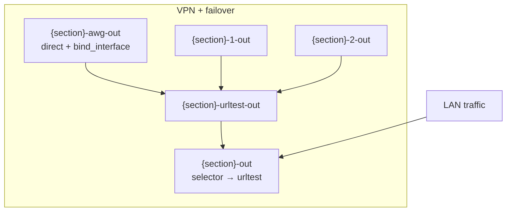
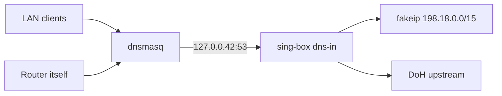

# Hybrid Failover: полное описание

Автономный стек маршрутизации для OpenWrt: нативный **VPN + резервные proxy** через **urltest** в sing-box, поддержка **Amnezia `vpn://`**, расширенный **URLTest**, **Telegram-бот** и **LuCI** на русском.

**Core:** `/usr/sbin/hybrid-failover` · **UCI:** `/etc/config/hybrid-failover` · **nft:** `inet hybrid_failover`

---

## Содержание

1. [Архитектура](#архитектура)
2. [Режимы маршрутизации](#режимы-маршрутизации)
3. [Поддерживаемые форматы ссылок (URI)](#поддерживаемые-форматы-ссылок-uri)
4. [Опции UCI](#опции-uci)
5. [Пакеты OpenWrt](#пакеты-openwrt)
6. [Установка](#установка)
7. [LuCI](#luci)
8. [Telegram-бот](#telegram-бот)
9. [Диагностика (Clash API)](#диагностика-clash-api)
10. [Типичные проблемы](#типичные-проблемы)
11. [Содержимое репозитория](#содержимое-репозитория)

---

## Архитектура

Go core **`hybrid-failover`** читает UCI, генерирует `/etc/sing-box/config.json`, настраивает **nft tproxy** (таблица `inet hybrid_failover`, mark `0x105`, порт **1602**) и управляет sing-box через init.d.



Для секции `glob` (имя произвольное, теги с этим префиксом):

| Outbound | Назначение |
|----------|------------|
| `{section}-awg-out` | Основной путь: **direct** через VPN-интерфейс (`option interface`, напр. `awg0`) |
| `{section}-1-out`, `{section}-2-out`, … | Резервы из `failover_proxy_links` (по одному на URI) |
| `{section}-urltest-out` | **urltest** по AWG + всем резервам |
| `{section}-out` | **selector**, по умолчанию указывает на urltest |

Порядок URI в списке = приоритет кандидатов после основного VPN (внутри urltest выбирается живой/быстрый).

CLI: `hybrid-failover migrate | validate | apply | start | stop | status | rpc … | check-fakeip | list-update | subscription-refresh`.

### DNS через 127.0.0.42

При `start` (если `dont_touch_dhcp=0`) core перенаправляет DNS роутера на sing-box:

1. **dnsmasq**: backup `/etc/hybrid-failover/dnsmasq-dhcp.bak`, `noresolv=1`, `server=127.0.0.42`.
2. **sing-box inbound `dns-in`**: слушает `127.0.0.42:53`, обрабатывает DNS (fakeip, DoH upstream, community rulesets).
3. **Проверка**: `hybrid-failover check-fakeip`: `dig @127.0.0.42 fakeip.hybrid-failover` → адрес `198.18.x.x`, затем HTTPS `/check` на порту **8443**.

При `stop` dnsmasq восстанавливается из backup.



### Pending-конфиг (LuCI / бот)

Изменения из LuCI или Telegram-бота накапливаются через pending workflow:

| Шаг | CLI / UI |
|-----|----------|
| Capture | `pending capture` / LuCI «Сохранить» → auto capture |
| Validate | `pending validate` / «Проверить» |
| Apply | `pending apply` → UCI commit + apply + reload sing-box |
| Rollback | `pending rollback` |

RPC: `CapturePending`, `PendingValidate`, `PendingApply`, `PendingRollback`. LuCI routing: save → capture, «Применить» → pending_apply.

### Списки и cron

- **`list-update`**: загрузка community rulesets в `/tmp/hybrid-failover/rulesets/` и **автоматический** `apply` + reload sing-box при изменении конфига.
- При **`start`** core вызывает list-update и перегенерирует sing-box, если списки скачались.
- **`update_interval`** (UCI `settings`, по умолчанию `1d`): cron entry `hybrid-failover list-update` (ставится при `start`, снимается при `stop`).
- Требуется **sing-box ≥ 1.12.4** (проверка в `lifecycle.Apply`).

---

## Режимы маршрутизации

### 1. VPN + failover

| UCI | Значение |
|-----|----------|
| `connection_type` | `vpn` |
| `failover_vpn_enabled` | `1` |
| `failover_proxy_links` | список URI (см. таблицу ниже) |
| `interface` | VPN-интерфейс, напр. `awg0` |

Поведение: трафик секции сначала идёт через VPN-интерфейс; при недоступности urltest переключается на резервные proxy из списка.

### 2. Proxy → URLTest

| UCI | Значение |
|-----|----------|
| `connection_type` | `proxy` |
| `proxy_config_type` | `urltest` |
| `urltest_proxy_links` | список URI |

Только proxy, без `bind_interface`. Те же URI и доп. опции urltest (см. ниже).

### Общие параметры URLTest

| Опция UCI | По умолчанию | Описание |
|-----------|--------------|----------|
| `urltest_check_interval` | `3m` | Интервал проверки |
| `urltest_tolerance` | `50` | Допуск по задержке (ms) |
| `urltest_testing_url` | `https://www.gstatic.com/generate_204` | URL для probe |
| `urltest_idle_timeout` | пусто | Таймаут простоя urltest (напр. `5m`) |
| `urltest_interrupt_exist_connections` | `0` | `1`: рвать существующие сессии при смене узла |
| `enable_udp_over_tcp` | н/п | Для SS/SOCKS в списках ссылок |

---

## Поддерживаемые форматы ссылок (URI)

Разбор в Go: `internal/uri`, Amnezia `vpn://`: `internal/amnezia` (без Python).

### В `failover_proxy_links` и `urltest_proxy_links`

| Схема | Поддержка | Примечание |
|-------|-----------|------------|
| `vless://` | да | Reality, XTLS, transport из query |
| `ss://` | да | Shadowsocks |
| `trojan://` | да | |
| `socks4://`, `socks4a://`, `socks5://` | да | `enable_udp_over_tcp` при необходимости |
| `hysteria2://`, `hy2://` | да | obfs, up/down mbps в query |
| `vpn://` | да | Экспорт **Amnezia** → декод в `vless://` (Go) |
| `awg2://` | да (служебный URI) | Не протокол; см. [ниже](#amnezia-awg2-awg2) |
| `http://`, `https://` | нет | Ошибка «Unsupported proxy scheme» |

### Amnezia `vpn://`

Декодер встроен в core (`internal/amnezia`). Поддерживается типичный экспорт **amnezia-xray** с VLESS в `last_config`. В LuCI строка `vpn://…` проходит валидацию как есть.

### Amnezia AWG2 (`awg2://`) {#amnezia-awg2-awg2}

`awg2://` **не** отдельный сетевой протокол. Это **служебный формат core** для настройки **AmneziaWG 2.0**:

1. создаётся интерфейс `amneziawg`;
2. конфиг применяется через `awg setconf`;
3. в sing-box добавляется direct outbound на этот интерфейс.

Строка `awg2://…` чаще всего появляется при конвертации `vpn://`, если в контейнере Amnezia указан `amnezia-awg2`.

### Telegram-бот: валидация URI

При добавлении ссылок через бота принимаются только: `vless`, `trojan`, `ss`, `vpn`. SOCKS / hysteria2 добавляйте через UCI/LuCI.

---

## Опции UCI

Подробная таблица: [`docs/UCI.md`](UCI.md). Пример команд: [`examples/glob-uci-commands.txt`](../examples/glob-uci-commands.txt).

Файл: **`/etc/config/hybrid-failover`**. Первичная настройка: `hybrid-failover migrate`.

### Миграция (schema v1)

- импорт прежнего UCI в `hybrid-failover`, если новый конфиг ещё не создан;
- `failover_vpn_enabled=0`, если опции не было;
- `failover_vpn_enabled=1`, если уже есть `failover_proxy_links` в VPN-секции;
- `urltest_interrupt_exist_connections=0`, если не задано;
- `settings.cache_path='/etc/sing-box/cache.db'`;
- `settings.config_schema_version=1`.

### Рекомендуемые глобальные настройки

```sh
uci set hybrid-failover.settings.cache_path='/etc/sing-box/cache.db'
uci commit hybrid-failover
```

---

## Пакеты OpenWrt

Собираются `./scripts/build-packages.sh`, публикуются в [Releases](https://github.com/timofey-maykov/openwrt-hybrid-failover/releases).

Бинарники сжимаются **UPX** (если `upx` установлен на машине сборки): ~6 МБ → ~1.8 МБ на `aarch64`. Отключить: `HF_UPX=0 ./scripts/build-packages.sh`. Требуется на хосте: `brew install upx` / `apt install upx-ucl`.

| Пакет | Architecture | Содержимое |
|-------|----------------|------------|
| `hybrid-failover-core` | per-target | `/usr/sbin/hybrid-failover`, init.d, шаблон UCI |
| `hybrid-failover-bot` | per-target | Go-бинарник, init.d, JSON/UCI-шаблон |
| `luci-app-hybrid-failover` | all | Маршрутизация, дашборд, клиенты, бот |

Зависимости core: `sing-box`, `curl`, `coreutils-base64`. **Без `jq` и `python3-light`.**

---

## Установка

Полная инструкция: [`docs/INSTALL.md`](INSTALL.md).

```sh
wget -O /tmp/install.sh \
  https://raw.githubusercontent.com/timofey-maykov/openwrt-hybrid-failover/main/scripts/install-on-router.sh
ash /tmp/install.sh
hybrid-failover migrate
/etc/init.d/hybrid-failover enable && /etc/init.d/hybrid-failover start
```

| Режим | Устанавливает |
|-------|----------------|
| `full` (по умолчанию) | core + bot + luci-app-hybrid-failover |
| `bot` | только bot + LuCI |

### После установки бота

1. [@BotFather](https://t.me/BotFather) → `/etc/hybrid-failover-bot.json`
2. `uci set hybrid-failover-bot.main.enabled=1 && uci commit hybrid-failover-bot`
3. `/etc/init.d/hybrid-failover-bot restart`
4. Telegram: `/panel`

---

## LuCI

**Сервисы → Hybrid Failover**: `/cgi-bin/luci/admin/services/hybrid-failover`

| Подраздел | Назначение |
|-----------|------------|
| Маршрутизация | VPN + failover, URLTest, подписки |
| Статус | Дашборд Clash API |
| Клиенты | Per-client include/exclude по IP |
| Telegram-бот | JSON, pending validate/apply/rollback |

Действия apply/validate через rpcd → `hybrid-failover rpc`.

---

## Telegram-бот

Полный список команд: [`bot/README.md`](../bot/README.md).

- UCI `hybrid-failover`, failover, `/health` через core RPC;
- pending-конфиг бота (validate / apply / rollback);
- `admin_ids`: полный доступ; `viewer_ids`: только чтение (`/status`, `/health`, `/channels`, `/history`);
- опционально `notify_failover_enabled` + `notify_failover_interval_seconds`: poll `history.jsonl` и push в Telegram при switch.

Конфиг `/etc/hybrid-failover-bot.json`: `token`, `admin_ids`, `clash_api`, `routing_init_script` (по умолчанию `/etc/init.d/hybrid-failover`).

### Алерты при failover

**Poll (бот):** включите `notify_failover_enabled: true` в `hybrid-failover-bot.json`. Бот tail-ит `/var/log/hybrid-failover/history.jsonl` и шлёт новые события всем `admin_ids`.

**Webhook (core):** в UCI `hybrid-failover.settings.webhook_url` укажите HTTP endpoint. Core вызывает его при каждом switch (JSON: from, to, reason). Пример relay в Telegram без бота:

```sh
# /usr/bin/hf-webhook-telegram: вызывается из procd/hotplug или curl из webhook receiver
TOKEN="123:ABC"
CHAT_ID="-100123"
curl -fsS -X POST "https://api.telegram.org/bot${TOKEN}/sendMessage" \
  -d "chat_id=${CHAT_ID}" \
  --data-urlencode "text=Failover: $HF_FROM → $HF_TO ($HF_REASON)"
```

На роутере можно повесить простой `uhttpd`/`nc` listener или внешний relay; core только делает `POST` на `webhook_url` с телом события.

---

## Диагностика (Clash API)

При включённом external controller (порт **9090** по умолчанию, настраивается `settings.clash_api_listen`):

```sh
wget -qO- 'http://ROUTER:9090/proxies/glob-urltest-out'
wget -qO- 'http://ROUTER:9090/proxies/glob-awg-out/delay?timeout=5000&url=http://www.gstatic.com/generate_204'
```

CLI: `hybrid-failover global-check`. Бот: `/health`, `/status`.

FakeIP на роутере: `hybrid-failover check-fakeip` (dig `@127.0.0.42 fakeip.hybrid-failover` + HTTPS check).

---

## Типичные проблемы

### `missing fakeip record` (sing-box)

- `uci set hybrid-failover.settings.cache_path='/etc/sing-box/cache.db'`
- `/etc/init.d/hybrid-failover restart`

### `/health`: connection refused к Clash API

- Проверить `clash_api_listen` (не только `127.0.0.1` на некоторых прошивках).
- В конфиге бота: `clash_api`: `http://192.168.x.1:9090`.

### Двойной failover

Удалите сторонние скрипты автоматического failover и отключите конфликтующие init.d-сервисы маршрутизации, если переходите на Hybrid Failover. `hybrid-failover migrate` предупреждает о найденных конфликтах.

---

## Содержимое репозитория

| Путь | Назначение |
|------|------------|
| `core/`, `internal/` | Go core |
| `packages/` | Сборка `.ipk` / `.apk` |
| `luci/` | luci-app-hybrid-failover |
| `bot/` | Telegram-бот |
| `openwrt/` | init.d, UCI-шаблон |
| `scripts/` | install-on-router.sh, build-packages.sh, QEMU lab |
| `docs/` | Документация |
| `legacy/` | Устаревшие patch-скрипты |
