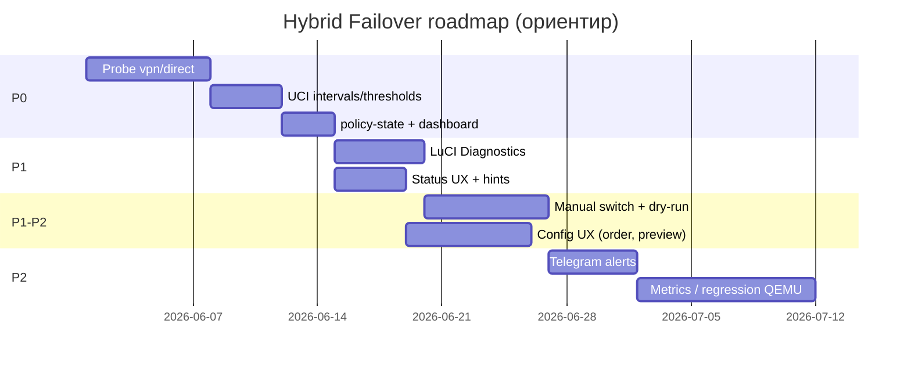

# Hybrid Failover: план доработок

Документ фиксирует приоритизированный backlog по результатам обзора (май 2026): LuCI/мониторинг, failover, конфигурация, эксплуатация, бот, качество.

**Связанные файлы:** [OVERVIEW.md](OVERVIEW.md) · [REGRESSION-CHECKLIST.md](REGRESSION-CHECKLIST.md) · [enterprise-failover-design](superpowers/specs/2026-05-29-enterprise-failover-design.md)

**Условные оценки:** S (&lt;1 дн), M (1–3 дн), L (3–7 дн), XL (&gt;1 нед)

---

## Цели

1. **Предсказуемый failover**: корректные probe для всех типов каналов, настраиваемые пороги и интервалы.
2. **Понятный UI**: Статус как NOC-дашборд; Маршрутизация/Клиенты без путаницы; меньше SSH.
3. **Наблюдаемость**: история, алерты, опционально метрики для Grafana.
4. **Зрелость релиза**: закрытие manual-пунктов regression, smoke LuCI в QEMU.

---

## Фаза 1: Стабильность и «слепые зоны» (P0)

*Срок ориентир: 1–2 недели. Блокирует доверие к Статусу и автоматическому failover.*

| # | Задача | Объём | Компонент | Критерий готовности |
|---|--------|-------|-----------|---------------------|
| 1.1 | **Probe для Direct / `vpn://` (Amnezia)** | L | `internal/diag`, `internal/clash`, возможно `internal/failover` | На дашборде glob-2 (и аналоги) показывают delay или явную причину; controller не считает «нет данных» как вечный fail без повтора |
| 1.2 | **UCI: `failover_probe_interval`** | S | `internal/failover`, UCI template, `docs/UCI.md` | Интервал фонового controller настраивается; default сохраняет текущее поведение (~30s) |
| 1.3 | **UCI: `fail_streak` / `recover_streak` пороги** | M | `internal/failover`, `internal/policy`, LuCI `routing.js` | Политики outage-only / prefer-primary читают пороги из UCI; unit-тесты |
| 1.4 | **Расширить `policy-state.json`** | S | `internal/failover` | Поля: `last_probe_at`, `last_switch_at`, `active_since`; отдаются в RPC Status |
| 1.5 | **Закрыть LuCI dashboard regressions** | S | `dashboard.js`, REGRESSION-CHECKLIST | Статус грузится без JS-ошибок на LuCI 24/25; пункты checklist отмечены |

**Зависимости:** 1.4 помогает 2.x (дашборд); 1.1 независима.

**Не входит в фазу 1:** ручное переключение канала, графики.

---

## Фаза 2: LuCI: диагностика и ясность конфигурации (P1)

*Срок: 2–3 недели после фазы 1.*

| # | Задача | Объём | Компонент | Критерий готовности |
|---|--------|-------|-----------|---------------------|
| 2.1 | **Вкладка или секция «Диагностика»** | M | LuCI view + rpcd | Кнопки: validate, check-nft, check-fakeip, global-check; вывод в UI |
| 2.2 | **Статус: fakeip / global-check** | S | `dashboard.js`, rpcd (при необходимости новые RPC-обёртки) | Одна кнопка на Статусе, результат в баннере |
| 2.3 | **Статус: версии в шапке** | S | RPC Status + dashboard | core version, schema, sing-box (если доступно) |
| 2.4 | **Статус: индикатор poll** | S | `dashboard.js` | «Обновлено HH:MM:SS», опционально countdown 5s |
| 2.5 | **Подсказки: Клиенты vs подсети назначения** | S | `clients.js`, `routing.js` | Тексты hint + ссылка на OVERVIEW; `routing_excluded_ips` объяснён |
| 2.6 | **Экспорт журнала failover** | S | rpcd + dashboard | Скачать/показать последние N строк history |
| 2.7 | **Ссылка Yacd / Clash UI** | S | `routing.js` или settings | Если `clash_api_listen` задан: кликабельный URL (с предупреждением о доступе) |

**Зависимости:** 2.1 может переиспользовать CLI из 2.2; rpcd ACL расширить при новых методах.

---

## Фаза 3: Управление каналами и конфигом (P1–P2)

*Срок: параллельно с фазой 2 или сразу после.*

| # | Задача | Объём | Компонент | Критерий готовности |
|---|--------|-------|-----------|---------------------|
| 3.1 | **Ручное переключение outbound (LuCI)** | M | `internal/clash`, rpcd `switch_proxy`, dashboard | Выбор секции + outbound, confirm, запись в history с reason=manual |
| 3.2 | **Dry-run «какой канал выбрали бы»** | M | diag + dashboard | Без смены selector; только отображение рекомендации controller |
| 3.3 | **Порядок резервов в UI** | M | `routing.js` (DynamicList + up/down) | Порядок URI в UCI = приоритет в urltest |
| 3.4 | **Превью decoded URI** | M | `internal/amnezia` RPC + routing | После вставки vpn://: endpoint/host без секрета или ошибка decode |
| 3.5 | **Validate on blur / debounced** | S | `routing.js` | Опционально: pending_validate после изменения критичных полей |
| 3.6 | **Шаблон «дублировать секцию»** | L | LuCI + UCI | Копия секции glob → glob2 с новым именем |

**Зависимости:** 3.1 требует ACL и аудит в history; 3.2 зависит от 1.1/1.4.

---

## Фаза 4: Наблюдаемость и ops (P2)

| # | Задача | Объём | Компонент | Критерий готовности |
|---|--------|-------|-----------|---------------------|
| 4.1 | **Ротация `history.jsonl`** | S | `internal/notify` или отдельный пакет | Max size / retention по дням в UCI |
| 4.2 | **Telegram: алерты при switch** | M | bot + controller webhook | Админы получают from→to + reason |
| 4.3 | **Telegram: /channels, /history** | S | bot | Паритет с LuCI Status |
| 4.4 | **Prometheus textfile / ubus metrics** | L | core, optional package | `hf_up`, `hf_active_outbound`, delays по каналам |
| 4.5 | **Sparkline задержек (лёгкий)** | M | dashboard + localStorage или файл в `/var/run` | 20–50 точек на канал, без тяжёлого TSDB |
| 4.6 | **Бэкап/restore UCI из LuCI** | M | rpcd + view | tar.gz download/upload с предупреждением |
| 4.7 | **REGRESSION: QEMU LAN + failover poll** | L | `scripts/regression-qemu.sh`, CI | Автоматизация пунктов «manual» из checklist |

---

## Фаза 5: Качество и экосистема (P3)

| # | Задача | Объём | Компонент | Критерий готовности |
|---|--------|-------|-----------|---------------------|
| 5.1 | **LuCI E2E smoke (ubus)** | M | scripts/CI | После lab install: status/health/history ok |
| 5.2 | **RPC aliases** | S | `internal/cmd` | `rpc status` → тот же handler что `Status` (документация) |
| 5.3 | **i18n luci-i18n** | M | отдельный пакет | EN/RU для dashboard и routing |
| 5.4 | **Тема LuCI: CSS tokens** | S | dashboard.css inline → variables | Читаемо при THEME FALLBACK |
| 5.5 | **Read-only Telegram role** | S | bot config | Отдельный список id только status |

---

## Порядок выполнения (рекомендуемый)

**Критический путь:** 1.1 → 1.2–1.3 → 2.1–2.2 → 3.1 → 4.2.

---

## Вне scope (пока)

- Полноценный Grafana stack на роутере (только экспорт метрик / textfile).
- Замена sing-box или Clash API другим control plane.
- Multi-WAN / policy routing вне fakeip+tproxy модели.
- Облачный central management нескольких роутеров.

---

## Обновление checklist при закрытии фаз

| Фаза | Пункты REGRESSION-CHECKLIST |
|------|-----------------------------|
| 1 | Failover manual → частично auto; Clash probe для всех типов |
| 2 | LuCI Services pages; Diagnostics |
| 4 | Bot `/health`; failover event; QEMU LAN |
| 5 | LuCI automated smoke |

---

## Решения, которые стоит принять до фазы 3

1. **Ручной switch**: разрешать любому outbound или только внутри urltest/selector секции?
2. **История задержек**: `localStorage` (только браузер) vs файл на роутере (общий для бота)?
3. **Prometheus**: отдельный пакет `hybrid-failover-exporter` или встроить в core?

---

## Версионирование релизов (предложение)

| Версия | Содержание |
|--------|------------|
| **1.2.0** | Фаза 1 (probe + UCI thresholds + policy-state) |
| **1.3.0** | Фаза 2 (LuCI diagnostics + status UX) |
| **1.4.0** | Фаза 3 (manual switch, config UX) |
| **1.5.0** | Фаза 4 (alerts, metrics, regression) |

Патчи (1.2.1, …): только исправления LuCI/безопасности между минорными релизами.

---

## Статус реализации (1.5.0)

| Фаза | Статус |
|------|--------|
| 1 | Реализовано: probe, UCI пороги/interval, policy-state timestamps |
| 2 | Реализовано: LuCI «Диагностика», meta/dry-run, hints, check-fakeip, export history, Yacd |
| 3 | Реализовано: manual switch, URI preview, reorder резервов, duplicate section, validate debounce |
| 4 | Реализовано: history rotation, sparkline (localStorage), backup/restore UCI, bot poll alerts + webhook docs, `/channels` health, `metrics.prom`, regression `luci` step |
| 5 | Реализовано: luci-i18n EN, viewer_ids, CSS tokens, `luci-ubus-smoke.sh` + QEMU |
